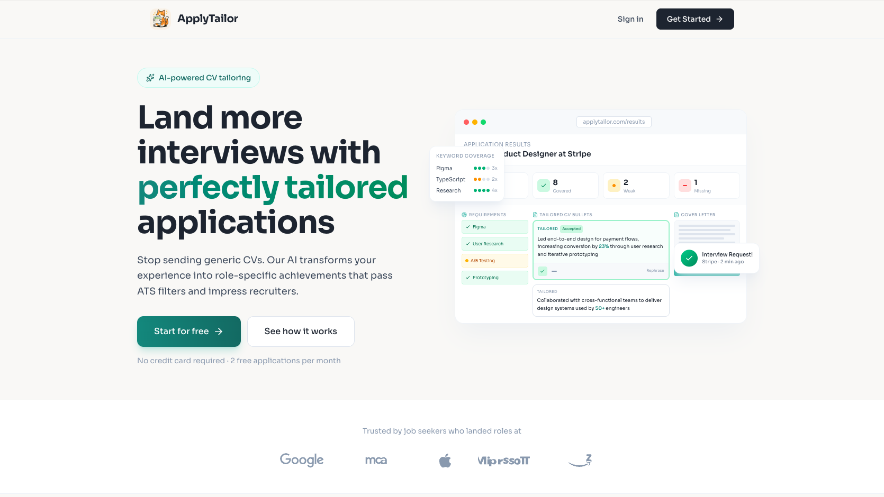
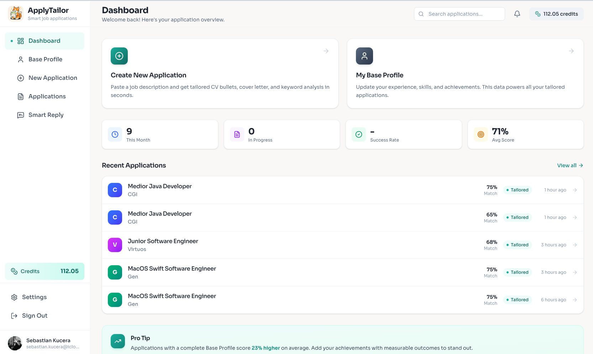
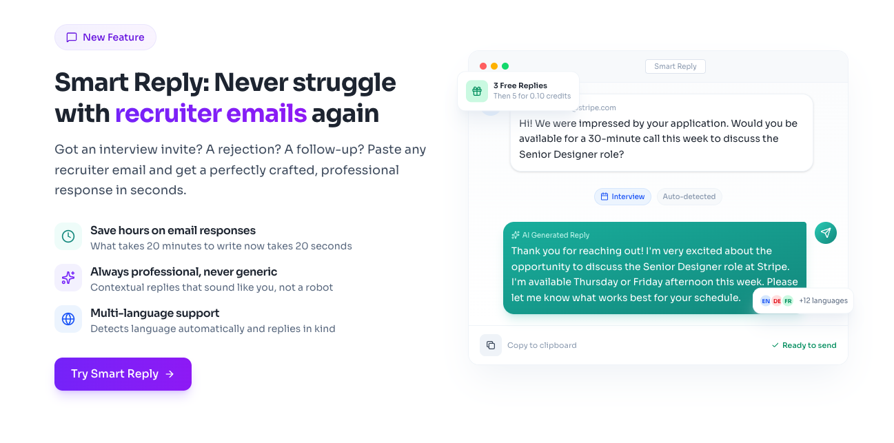

  

<h1 align="center">ApplyTailor</h1>

  <strong>Land more interviews with AI-tailored applications</strong>

  Stop sending generic resumes. ApplyTailor analyzes job descriptions and instantly generates 
  tailored CV bullets, cover letters, and professional email responses.

  <a href="https://applytailor.com">Website</a> •
  <a href="#how-it-works">How It Works</a> •
  <a href="#features">Features</a> •
  <a href="#tech-stack">Tech Stack</a>

---

## The Problem

Applying to jobs is exhausting. You find a great role, but then spend hours:
- Rewriting your resume to match keywords
- Crafting a cover letter that doesn't sound generic
- Responding professionally to recruiter emails

Most people give up and send the same resume everywhere. **Result?** Low response rates.

## The Solution

**ApplyTailor** does the heavy lifting. Paste a job description, and in seconds get:

✅ **Tailored CV bullets** that highlight relevant experience
✅ **Keyword analysis** showing what skills to emphasize
✅ **Match score** to see how well you fit
✅ **Professional cover letter** ready to send
✅ **Smart replies** to recruiter emails

---

## How It Works

### 1. Build Your Base Profile
Enter your experience, skills, and achievements once. This powers all your applications.

### 2. Paste a Job Description
Copy any job posting. Our AI analyzes requirements, keywords, and company context.

### 3. Get Tailored Content
Instantly receive customized CV bullets, a cover letter, and match analysis.

### 4. Export & Apply
Download your tailored CV as PDF or copy content directly. Apply with confidence.

---

## Features

### 🎯 Smart CV Tailoring
Your experience, rewritten to match what employers are looking for. Each bullet point is optimized with relevant keywords and achievements.

### 📝 Cover Letter Generation
No more staring at a blank page. Get a personalized cover letter that connects your background to the role.

### 📊 Match Analysis
See exactly how your profile stacks up against job requirements. Know your strengths and gaps before applying.

### 💬 Smart Reply
Paste emails from recruiters—interview invites, rejections, follow-ups, offers—and get professional responses instantly.

### 📄 PDF Export
Multiple professional templates to choose from. Export your tailored CV with one click.

### 📱 Application Tracking
Keep all your applications organized. Track status from draft to offer accepted.

---

## Tech Stack

| | |
|---|---|
| **Frontend** | React 19, Vite, Tailwind CSS 4, Framer Motion |
| **Backend** | Supabase (PostgreSQL, Auth, Edge Functions) |
| **AI** | Anthropic Claude |
| **Payments** | Stripe |
| **Hosting** | Vercel |

---

## Screenshots

  
   
  <em>Landing — AI-powered CV tailoring that helps you land more interviews</em>

 

  
   
  <em>Dashboard — Track all your applications with stats and quick actions</em>

 

  
   
  <em>Smart Reply — Professional responses to recruiter emails in seconds</em>

---

## Pricing

| Plan | What You Get |
|------|--------------|
| **Free** | 3 Smart Replies |
| **Per Application** | 1 credit = Full tailored application |
| **Refinements** | 5 free edits per application |

---

  <strong>Stop sending generic applications.</strong> 
  <a href="https://applytailor.com">Try ApplyTailor →</a>

---

  Built with Claude AI

